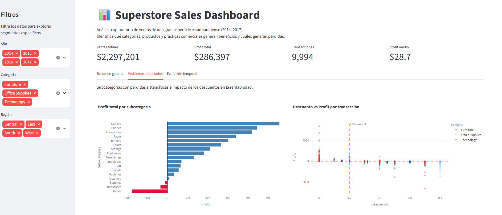

# 📊 Superstore Sales Dashboard

Dashboard interactivo con análisis exploratorio completo sobre ventas de una gran superficie estadounidense (2014–2017).

**[Ver app desplegada](https://proyecto-eda-ventas-nsdlcb5tjamt8j46uxpun7.streamlit.app/)**



---

## Objetivo

Identificar qué categorías, productos y prácticas comerciales generan beneficios y cuáles generan pérdidas, con recomendaciones accionables para el negocio.

---

## Insights clave

**Tables destruye valor sistemáticamente** - acumula -17.725$ en 4 años consecutivos de pérdidas. Eliminación del catálogo recomendada.

**Descuentos superiores al 40% nunca son rentables** - sin excepción, ninguna transacción con descuento mayor al 40% genera profit positivo.

**Machines cambia de tendencia en 2017** - tras 3 años rentables, entra en pérdidas. Señal de alarma que requeriría investigación inmediata.

**Technology es el motor del negocio** - Copiers, Phones y Accessories lideran el profit de forma consistente.

**West supera a Central en un ratio de 2.73x** - brecha que sugiere prácticas comerciales replicables en otras regiones.

---

## Stack tecnológico

- **Python** - lenguaje principal
- **Pandas** - carga, limpieza y análisis de datos
- **Plotly** - visualizaciones interactivas
- **Streamlit** - dashboard web desplegado en Streamlit Cloud
- **Jupyter Notebook** - análisis exploratorio documentado

---

## Estructura del proyecto
```
proyecto-01-eda-ventas/
-data/
    -superstore.csv
-notebooks/
    -01_eda_superstore.ipynb
-app/
    -dashboard.py
    -tabs/
        -tab_evolucion.py
        -tab_problemas.py
        -tab_resumen.py
-assets/
    -dashboard_general.png
    -dashboard_problemas.png
    -dashboard_evolucion.png
-requirements.txt
-README.md
```

---
## Ejecutar en local
```bash
git clone https://github.com/manuelpalasanchez/proyecto-eda-ventas.git
cd proyecto-eda-ventas
python -m venv venv
venv\Scripts\activate
pip install -r requirements.txt
streamlit run app/dashboard.py
```

---
## Notebook

El análisis exploratorio completo está documentado paso a paso en [`notebooks/01_eda_superstore.ipynb`](notebooks/01_eda_superstore.ipynb), incluyendo preguntas de negocio, análisis numérico, visualizaciones e insights finales.

---

*Dataset: [Sample Superstore - Kaggle](https://www.kaggle.com/datasets/vivek468/superstore-dataset-final) — 9.994 transacciones, 2014–2017.*